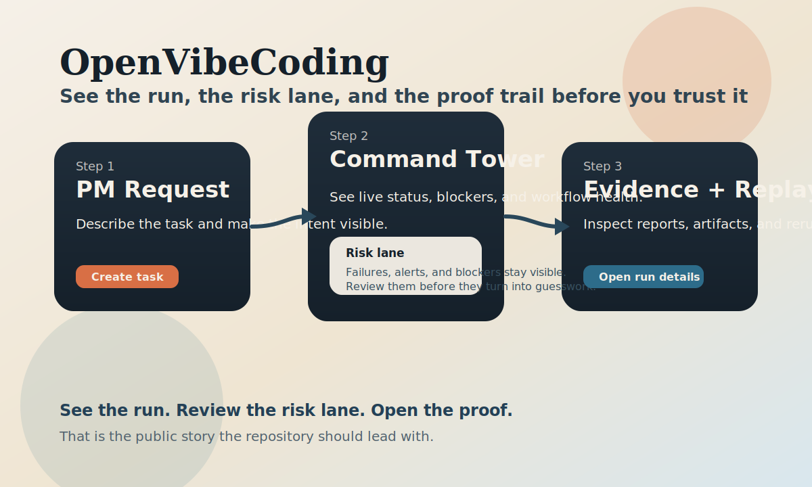

# CortexPilot

Governed AI task orchestration for teams that need **auditable runs, evidence,
replay, and operator visibility** instead of one-shot agent output.

CortexPilot is a contract-first multi-agent orchestration repository.

[Quickstart](#quickstart) · [Docs](docs/README.md) · [Architecture](docs/architecture/runtime-topology.md) · [Spec](docs/specs/00_SPEC.md) · [Releases](https://github.com/xiaojiou176-open/CortexPilot/releases)



The default public loop is simple: **send one request, watch the run move
through Command Tower, then inspect the evidence bundle and replay path**.

If this repository is close to your use case, star it to track the first public
release, new task templates, and storefront updates.

## Why CortexPilot Exists

Most agent demos stop at "the model replied." CortexPilot is built for the next
question: **can we inspect what happened, review what changed, and rerun it
without guessing?**

This repository combines:

- **Governed execution**: contracts and gates stay explicit instead of hiding in prompt glue
- **Evidence-first runs**: outputs are paired with run artifacts, reports, and review surfaces
- **Replay and re-exec**: inspect failures, compare reruns, and keep the chain auditable
- **Operator surfaces**: use the web dashboard or desktop shell to watch and control the same system

## Quickstart

### First Success Path

1. Bootstrap the host toolchain:

   ```bash
   npm run bootstrap:host
   ```

2. Run the smallest verified safety path:

   ```bash
   CORTEXPILOT_HOST_COMPAT=1 bash scripts/test_quick.sh --no-related
   ```

3. Open the web operator surface:

   ```bash
   npm run dashboard:dev
   ```

What you should see:

- create a task from the PM surface
- watch status move in Command Tower
- inspect runs, reports, and evidence from the run list

If you want the full reproducible containerized setup instead of the shortest
host path, use:

```bash
npm run bootstrap
```

If the first success path fails, go here next:

- [30-minute onboarding](docs/runbooks/onboarding-30min.md)
- [Support](SUPPORT.md)
- [Security reporting](SECURITY.md)

## The First Loop

The clearest way to understand CortexPilot is:

1. **PM**: describe the task and acceptance target
2. **Command Tower**: confirm the run is moving and not stuck
3. **Runs / Evidence**: inspect reports, diffs, artifacts, and replay state

That flow already exists in the dashboard app and is the public story this
repository should be judged on.

## Public Platform Boundary

- orchestrator and dashboard remain part of the public repository surface
- desktop public support is currently **macOS only**
- Linux/BSD desktop is unsupported in the current public support contract; any
  related evidence is manual or historical only and excluded from the default
  closeout and governance receipt path
- Windows desktop is not part of the current public support contract

## Current Public Task Slices

The intentionally supported public task slices are:

- `news_digest`
- `topic_brief`
- `page_brief`

The current guided dashboard entry is `news_digest`, while the broader public
contract surface still includes `topic_brief` and `page_brief`.

For the first public release bundle, `news_digest` is the only official
proof-oriented first-run baseline. `topic_brief` and `page_brief` remain part
of the broader public surface, but they should not be described as equally
release-proven until they have their own healthy proof and benchmark artifacts.

## Best Fit

CortexPilot is a strong fit if you are building or evaluating:

- agent workflows that need **reviewable evidence**
- orchestration systems that need **replay / re-exec**
- operator-facing control planes for **runs, sessions, and reports**
- engineering teams that want **explicit contracts and hard gates**

## Not A Fit

CortexPilot is not the right choice if you want:

- a polished hosted SaaS product
- a generic browser automation grab-bag
- a minimal single-file agent script with no governance overhead
- a broad-market no-ops-required end-user application

## Repository Surfaces

| Surface | What it does | Where to start |
| --- | --- | --- |
| `apps/orchestrator/` | execution, gates, evidence, replay, runtime state | [module README](apps/orchestrator/README.md) |
| `apps/dashboard/` | web operator surface for runs, sessions, and command visibility | [module README](apps/dashboard/README.md) |
| `apps/desktop/` | Tauri desktop shell for the same control plane | [module README](apps/desktop/README.md) |

## Public Collaboration Files

- [MIT License](LICENSE)
- [Contributing guide](CONTRIBUTING.md)
- [Security policy](SECURITY.md)
- [Support guide](SUPPORT.md)
- [Code of conduct](CODE_OF_CONDUCT.md)
- [Privacy note](PRIVACY.md)
- [Third-party notices](THIRD_PARTY_NOTICES.md)

Public bugs, documentation fixes, and usage questions go through
[SUPPORT.md](SUPPORT.md). Vulnerabilities go through
[SECURITY.md](SECURITY.md), which documents the GitHub advisory form as the
current private reporting path. An additional fallback private channel is not
yet established and should not be assumed.

Current repo-side verification entrypoints:

```bash
npm run test
npm run test:quick
bash scripts/check_repo_hygiene.sh
```

Useful additional entrypoints:

```bash
npm run space:audit
npm run dashboard:dev
npm run desktop:up
npm run truth:triage
```

## Required Check Policy

`configs/github_control_plane_policy.json` is the machine source of truth for
the repo-side required check names. Keep human-facing wording aligned with that
file, and keep this README as the only handwritten summary:

- `Quick Feedback`
- `PR Release-Critical Gates`
- `PR CI Gate`

Dashboard dependency lock refreshes are repo-owned maintenance work. When a
transitive patch touches `apps/dashboard/pnpm-lock.yaml`, keep the change set
paired with the root `package.json` / `pnpm-lock.yaml` update.
Current lock maintenance also removes the optional dashboard `depcheck`
dependency and pins patched `picomatch` / `brace-expansion` paths so GitHub
security findings do not linger on an otherwise unused dependency chain.
Desktop production builds run on Vite 8 / Rolldown; keep
`apps/desktop/vite.config.ts` vendor chunking in the current function-based
`manualChunks` form so `vite build` and the `ui-audit` closeout lane stay
compatible.
When one closeout patch touches both dashboard and desktop packaging, expect the
root AI/docs entrypoints and the module READMEs to move together so doc-sync
gates can trace the maintenance decision end to end.

## Release Track

The public release surface now has a live baseline. Use these entrypoints:

- [GitHub Releases page](https://github.com/xiaojiou176-open/CortexPilot/releases)
- [Live GitHub Release `v0.1.0-alpha.1`](https://github.com/xiaojiou176-open/CortexPilot/releases/tag/v0.1.0-alpha.1)
- [Live GitHub Pages site](https://xiaojiou176-open.github.io/CortexPilot/)
- [Changelog](CHANGELOG.md)
- [Public release checklist](docs/runbooks/public-release-checklist.md)
- [First public release draft](docs/releases/first-public-release-draft.md)
- [Tracked healthy `news_digest` proof summary](docs/releases/assets/news-digest-healthy-proof-2026-03-27.md)
- [Tracked `news_digest` baseline summary](docs/releases/assets/news-digest-benchmark-summary-2026-03-27.md)

## What’s Next

- configure the GitHub social preview with the tracked PNG asset
- add a tracked healthy demo/GIF
- expand the current single-run benchmark baseline into a broader public
  benchmark artifact

## Read Deeper

1. [Documentation map](docs/README.md)
2. [Runtime topology](docs/architecture/runtime-topology.md)
3. [Engineering spec](docs/specs/00_SPEC.md)
4. [Public release checklist](docs/runbooks/public-release-checklist.md)
5. [Storefront share kit](docs/runbooks/storefront-share-kit.md)
6. [Apps overview](apps/README.md)

## FAQ

### Is this already a polished end-user product?

No. The repository already contains strong operator surfaces and governance
machinery, but it should still be read as an engineering control plane rather
than a finished hosted product.

### Where should I look first if I only want the main path?

Start with the PM surface, then Command Tower, then Runs and evidence.

### Do I need the full desktop shell to evaluate the repository?

No. The shortest first pass is the host bootstrap, quick checks, and dashboard
flow. The desktop shell is a second operator surface, not the only way in.

## Contributing

Before opening a PR, read [CONTRIBUTING.md](CONTRIBUTING.md) and run the
relevant verification commands locally. Keep changes narrow, auditable, and
evidence-backed.

## License

CortexPilot is released under the MIT License. See [LICENSE](LICENSE).
