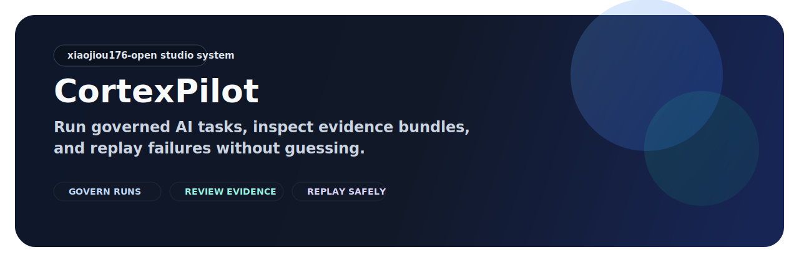

# CortexPilot

Command Tower for Codex and Claude Code workflows with MCP-readable proof,
replay, and Workflow Cases.

CortexPilot is a contract-first orchestration repo for Codex / Claude Code
teams that want one operator surface, one governed run path, and one
replayable evidence trail instead of scattered agents, logs, and scripts.

CortexPilot is a contract-first multi-agent orchestration repository.

CortexPilot is an AI agent command tower built around three product words:
**Command Tower**, **Workflow Cases**, and **Proof & Replay**.

The current public story speaks first to Codex / Claude Code teams and second
to broader AI ops / platform teams. The front door should ride the heat around
those ecosystems without pretending CortexPilot is already a hosted operator
service.

The product name stays **CortexPilot**. If `cortexpilot.ai` is later claimed,
treat it as a marketing/front-door domain, not as a product rename.

[Quickstart](#quickstart) · [Docs](docs/README.md) · [Architecture](docs/architecture/runtime-topology.md) · [Ecosystem & Builder Surfaces](docs/architecture/ecosystem-and-builder-surfaces-v1.md) · [Client Entry Points](packages/frontend-api-client/README.md) · [Spec](docs/specs/00_SPEC.md) · [Releases](https://github.com/xiaojiou176-open/CortexPilot-public/releases)




The default public loop is simple: **start one workflow case, watch it move
through Command Tower, then inspect Proof & Replay before you trust the
outcome**.

## First Practical Win

If you only want the fastest truthful first result, use one of these three
paths:

| I want to... | Run this first | What I get |
| --- | --- | --- |
| see the operator surface quickly | `npm run bootstrap:host && npm run dashboard:dev` | the PM surface, Command Tower, and run visibility in one local product loop |
| validate the smallest governed path | `CORTEXPILOT_HOST_COMPAT=1 bash scripts/test_quick.sh --no-related` | the quickest repo-side proof path without pretending the full system already ran |
| inspect what the system records | open the run list and `.runtime-cache/` after the quick path | a concrete evidence bundle and replay surface, not just a shell success line |

If this repository is close to your use case, star it to track the first public
release, new task templates, and storefront updates.

## Why CortexPilot Exists

Most agent demos stop at "the model replied." CortexPilot is built for the next
question: **can we inspect what happened, review what changed, classify the
workflow case, and rerun it without guessing?**

This repository combines:

- **Command Tower**: one operator surface for governed AI agents, MCP tools, and live run visibility
- **Workflow Cases**: one stable operating record that ties request, queue, verdict, and linked runs together
- **Proof & Replay**: one place to inspect evidence bundles, compare reruns, and replay failures without guessing
- **Operator surfaces**: use the web dashboard or desktop shell to watch and control the same system

## Quickstart

### First Success Path

1. Bootstrap the host toolchain:

   ```bash
   npm run bootstrap:host
   ```

2. Run the smallest verified safety path:

   ```bash
   CORTEXPILOT_HOST_COMPAT=1 bash scripts/test_quick.sh --no-related
   ```

3. Open the web operator surface:

   ```bash
   npm run dashboard:dev
   ```

What you should see:

- create a task from the PM surface
- watch status move in Command Tower
- confirm the Workflow Case state, then inspect runs, reports, and evidence from the run list

If you want the full reproducible containerized setup instead of the shortest
host path, use:

```bash
npm run bootstrap
```

If the first success path fails, go here next:

- [30-minute onboarding](docs/runbooks/onboarding-30min.md)
- [Support](SUPPORT.md)
- [Security reporting](SECURITY.md)

## The First Loop

The clearest way to understand CortexPilot is:

1. **PM**: describe the task and acceptance target
2. **Workflow Case**: confirm the case identity, queue state, and operating verdict
3. **Command Tower**: confirm the run is moving and not stuck
4. **Proof & Replay**: inspect reports, diffs, artifacts, compare state, and replay state

That flow already exists in the dashboard app and is the public story this
repository should be judged on.

## Public Platform Boundary

- orchestrator and dashboard remain part of the public repository surface
- desktop public support is currently **macOS only**
- Linux/BSD desktop is unsupported in the current public support contract; any
  related evidence is manual or historical only and excluded from the default
  closeout and governance receipt path
- Windows desktop is not part of the current public support contract
- the repo-local MCP surface is currently **read-only only**; write-capable MCP
  remains gated and is not part of the current public/product contract
- CortexPilot is still **not** a hosted operator service; `cortexpilot.ai`
  should be treated as a marketing/holding domain until the public contract,
  support boundary, and live surface materially change

## Public CI Safety Model

Public collaboration follows a hosted-first contract:

- all default public CI routes run on **GitHub-hosted** runners
- fork PRs stay on a low-privilege path and must not touch secrets, live
  providers, or high-cost external checks
- maintainer-owned PRs still use GitHub-hosted policy/core lanes; they do not
  fall back to private runner pools
- sensitive verification lanes (`ui-truth`, `resilience-and-e2e`,
  `release-evidence`) are **manual `workflow_dispatch` lanes only**
- sensitive lanes require the protected environment
  `owner-approved-sensitive`, so owner review happens before secrets or live
  systems are touched

The machine CI contract lives in `configs/ci_governance_policy.json`, and the
live GitHub control-plane requirements live in
`configs/github_control_plane_policy.json`.

## Current Public Task Slices

The intentionally supported public task slices are:

- `news_digest`
- `topic_brief`
- `page_brief`

The current dashboard front door now surfaces all three public cases, while
`news_digest` remains the most release-proven proof-oriented first run.

| Public case | Best for | Example input | Proof state |
| --- | --- | --- | --- |
| `news_digest` | the fastest proof-oriented public first run | one topic + 3 public domains + `24h` | **official first public baseline** |
| `topic_brief` | a narrow topic brief with search-backed evidence | one topic + `7d` + max results | public showcase, not yet equally release-proven |
| `page_brief` | one URL with browser-backed evidence | one URL + one focused summary request | public showcase, browser-backed path |

For the first public release bundle, `news_digest` is the only official
proof-oriented first-run baseline. `topic_brief` and `page_brief` remain part
of the broader public surface, but they should not be described as equally
release-proven until they have their own healthy proof and benchmark artifacts.

## Works With Today

Use these names as ecosystem anchors, not as co-brands or partnership claims.

- **Codex**: primary workflow audience; CortexPilot is built for governed
  Codex-style coding runs that need cases, approvals, and replayable proof.
- **Claude Code**: primary workflow audience alongside Codex; the same
  Command Tower / Workflow Case / Proof & Replay spine applies.
- **MCP**: the current product truth is a **read-only MCP surface** for runs,
  workflows, queue posture, approvals, and proof-oriented reads.
- **OpenHands**: adjacent ecosystem mention only; use it in body-copy
  comparison or “broader agent stacks” language, not in the hero.
- **OpenCode**: comparison-only and transition-sensitive; do not use it as a
  primary front-door anchor.
- **OpenClaw**: different product category; keep it out of the current front
  door.

## First Run To Proof To Share

The strongest public loop is now:

1. Start one of the three public first-run cases.
2. Confirm the result in **Command Tower**, **Workflow Cases**, and
   **Proof & Replay**.
3. Reuse the Workflow Case as a **share-ready recap asset** instead of keeping
   it trapped inside a single operator page.

That turns CortexPilot from “a repo you can run” into “a repo you can show,
review, and hand off.”

## Builder Entry Points

These are the current public-facing entry points for teams that want to build
around CortexPilot without pretending a full SDK platform already exists:

- [packages/frontend-api-client/README.md](packages/frontend-api-client/README.md): thin JavaScript/TypeScript client entry points for dashboard, desktop, and web surfaces.
- [packages/frontend-api-contract/index.d.ts](packages/frontend-api-contract/index.d.ts): generated contract surface and stable import boundary for API-facing types.
- [packages/frontend-shared/README.md](packages/frontend-shared/README.md): shared UI copy, locale, status, and frontend-only presentation helpers.
- [docs/architecture/ecosystem-and-builder-surfaces-v1.md](docs/architecture/ecosystem-and-builder-surfaces-v1.md): the human-readable map that explains how Codex / Claude Code / MCP / public packs / share-ready Workflow Cases fit together.

## Best Fit

CortexPilot is a strong fit if you are building or evaluating:

- agent workflows that need **reviewable evidence**
- orchestration systems that need **replay / re-exec**
- operator-facing control planes for **runs, sessions, and reports**
- engineering teams that want **explicit contracts and hard gates**

## Not A Fit

CortexPilot is not the right choice if you want:

- a polished hosted SaaS product
- write-capable agent control-plane mutations through MCP today
- a generic browser automation grab-bag
- a minimal single-file agent script with no governance overhead
- a broad-market no-ops-required end-user application

## Current Boundary Decisions

The current stage freeze keeps two high-risk directions explicitly constrained:

- **Write-capable MCP** remains **Later**.
- The public repo ships a **read-only MCP** surface only.
- Internal mutation APIs and approval flows exist, but they are not yet
  exposed as an agent-facing write surface.
- If this is ever reopened, the smallest safe move is one owner-only,
  manual-only, default-off queue mutation pilot with explicit audit evidence.

- **Hosted operator surface** remains **No-Go**.
- `cortexpilot.ai` is still a weak marketing/holding domain, not a production
  front door.
- The current public contract still describes CortexPilot as source code plus
  operator/demo surfaces, not as a hosted service.
- Reopen hosted only if the public boundary, support contract, privacy/security
  wording, and live front door materially change together.

## Repository Surfaces

| Surface | What it does | Where to start |
| --- | --- | --- |
| `apps/orchestrator/` | execution, gates, evidence, replay, runtime state | [module README](apps/orchestrator/README.md) |
| `apps/dashboard/` | web operator surface for runs, sessions, and command visibility | [module README](apps/dashboard/README.md) |
| `apps/desktop/` | Tauri desktop shell for the same control plane | [module README](apps/desktop/README.md) |

## Public Collaboration Files

- [MIT License](LICENSE)
- [Contributing guide](CONTRIBUTING.md)
- [Security policy](SECURITY.md)
- [Support guide](SUPPORT.md)
- [Code of conduct](CODE_OF_CONDUCT.md)
- [Privacy note](PRIVACY.md)
- [Third-party notices](THIRD_PARTY_NOTICES.md)

Public bugs, documentation fixes, and usage questions go through
[SUPPORT.md](SUPPORT.md). Vulnerabilities go through
[SECURITY.md](SECURITY.md), which documents the GitHub advisory form as the
current private reporting path on the live public repository. An additional
verified fallback private channel is not yet published and should not be
assumed.

Current repo-side verification entrypoints:

```bash
npm run test
npm run test:quick
bash scripts/check_repo_hygiene.sh
```

Recent operator-surface upgrades now include:

- persisted `workflow case` snapshots under `.runtime-cache/cortexpilot/workflow-cases/`
- derived `proof_pack.json` reports for successful public task slices
- a dedicated run-compare surface alongside the existing Run Detail replay area
- a repo-local `mcp-readonly-server` entry for read-only runs/workflows/queue/approval/diff-gate/report access
- an AI operator copilot brief on dashboard Run Detail and Run Compare, grounded in compare/proof/incident/workflow truth
- a share-ready Workflow Case asset path in the dashboard for read-only recap, export, and handoff
- desktop-first Flight Plan preview before creating the first PM session
- queue scheduling inputs (`priority`, `scheduled_at`, `deadline_at`) with
  timezone-safe API validation

Useful additional entrypoints:

```bash
npm run space:audit
npm run space:gate:wave1
npm run space:gate:wave2
npm run space:gate:wave3
npm run dashboard:dev
npm run desktop:up
npm run truth:triage
```

## Generated Governance Context

<!-- GENERATED:ci-topology-summary:start -->
- trust flow: `ci-trust-boundary -> quick-feedback -> hosted policy/core slices -> pr-release-critical-gates -> pr-ci-gate`
- hosted policy/core slices: `policy-and-security, core-tests`
- untrusted PR path: `quick-feedback -> untrusted-pr-basic-gates -> pr-ci-gate`
- protected sensitive lanes: `workflow_dispatch -> owner-approved-sensitive -> ui-truth / resilience-and-e2e / release-evidence`
- canonical machine SSOT: `configs/ci_governance_policy.json`
<!-- GENERATED:ci-topology-summary:end -->

<!-- GENERATED:current-run-evidence-summary:start -->
- authoritative release-truth builders must consume `.runtime-cache/cortexpilot/reports/ci/current_run/source_manifest.json`.
- the live current-run authority verdict belongs to `python3 scripts/check_ci_current_run_sources.py` and `.runtime-cache/cortexpilot/reports/ci/current_run/consistency.json`.
- current-run builders: `artifact_index/current_run_index`, `cost_profile`, `runner_health`, `slo`, `portal`, `provenance`.
- docs and wrappers must not hand-maintain live current-run status; they must point readers back to the checker receipts.
- if the current-run source manifest is missing, authoritative current-run reports must fail closed or run only in explicit advisory mode.
<!-- GENERATED:current-run-evidence-summary:end -->

<!-- GENERATED:coverage-summary:start -->
- repo coverage snapshot unavailable
- run `npm run coverage:repo` to refresh this fragment.
<!-- GENERATED:coverage-summary:end -->

## Required Check Policy

`configs/github_control_plane_policy.json` is the machine source of truth for
the repo-side required check names. Keep human-facing wording aligned with that
file, and keep this README as the only handwritten summary:

- `Quick Feedback`
- `PR Release-Critical Gates`
- `PR CI Gate`

Dashboard dependency lock refreshes are repo-owned maintenance work. When a
transitive patch touches `apps/dashboard/pnpm-lock.yaml`, keep the change set
paired with the root `package.json` / `pnpm-lock.yaml` update.
Current lock maintenance also removes the optional dashboard `depcheck`
dependency and pins patched `picomatch` / `brace-expansion` paths so GitHub
security findings do not linger on an otherwise unused dependency chain.
Desktop production builds run on Vite 8 / Rolldown; keep
`apps/desktop/vite.config.ts` vendor chunking in the current function-based
`manualChunks` form so `vite build` and the `ui-audit` closeout lane stay
compatible.
Dashboard/operator wording is now English-first across the tracked Command
Tower regression surface, and orchestrator intake responses only emit
`task_template` / `template_payload` when those values are actually present so
API/schema coverage and the live contract stay aligned.
Mainline CI now keeps policy snapshots, stage logs, and the orchestrator
coverage JSON under `.runtime-cache/test_output/ci/`, and the Python
dependency audit now pins `pygments==2.20.0`, so
`configs/pip_audit_ignored_advisories.json` is empty again instead of carrying
an upstream-unfixed downgrade for that package.
Upstream governance evidence now reuses only fully fresh smoke receipts; if
strict lanes do not already have the required upstream receipt bundle, the
governance manifest refresh falls back to `scripts/verify_upstream_slices.py --mode smoke`
to regenerate the receipts instead of failing on missing files alone.
Dashboard dependency installs now also carry an ENOSPC recovery branch that
retries with a workspace-local pnpm store and the registered dashboard install
env knobs when copy-heavy CI or local maintenance installs run out of disk.
Desktop dependency installs now mirror the same ENOSPC recovery strategy,
including the registered desktop install env knobs that scope hardlink imports
to the recovery attempt and move retry stores onto workspace-local temp roots.
Docker-backed GitHub-hosted maintenance lanes now retry daemon prechecks with
bounded backoff and registered retry knobs before failing closed on a transient
socket refusal.
Strict hosted-first live provider probes now resolve credentials from process
env first and may fall back to `~/.codex/config.toml`; repo-local dotenv files
and shell-export fallback remain disabled in mainline contexts so the CI
credential contract stays auditable.
Runtime retention and space-governance now stay coupled at the report layer:
`retention_report.json` carries `log_lane_summary` plus `space_bridge`, while
space-governance receipts expose serial-only heavy cleanup ordering, expected
reclaim bytes, and post-cleanup verification metadata. Repo-external apply
scope remains limited to `~/.cache/cortexpilot`; Docker Desktop, global
Cargo/Rustup, global uv, global npm, and global Playwright remain observation
only.
Docker-heavy local CI residue now has its own operator lane:

- `npm run docker:runtime:audit`
- `npm run docker:runtime:prune:rebuildable`
- `npm run docker:runtime:prune:aggressive`
- `npm run docker:runtime:prune:aggressive:full`

Use the Docker runtime lane for `cortexpilot-ci-core:local`,
`cortexpilot-ci-desktop-native:local`, and stale repo container residue. Keep
`space:cleanup:wave*` focused on repo-local residue and the governed
`~/.cache/cortexpilot` namespace. Aggressive cleanup skips images that still
back running containers, and the `:full` variant adds repo-related named volume
removal. The lane only applies cleanup to CortexPilot-owned images, containers,
and repo-prefixed volumes; workstation-global Docker/cache totals remain
audit-only observations.
When one closeout patch touches both dashboard and desktop packaging, expect the
root AI/docs entrypoints and the module READMEs to move together so doc-sync
gates can trace the maintenance decision end to end.

## Release Track

The public release surface now has a live baseline. Use these entrypoints:

- [GitHub Releases page](https://github.com/xiaojiou176-open/CortexPilot-public/releases)
- [Live GitHub Release `v0.1.0-alpha.1`](https://github.com/xiaojiou176-open/CortexPilot-public/releases/tag/v0.1.0-alpha.1)
- [Live GitHub Pages site](https://xiaojiou176-open.github.io/CortexPilot-public/)
- [Changelog](CHANGELOG.md)
- [Public release checklist](docs/runbooks/public-release-checklist.md)
- [First public release draft](docs/releases/first-public-release-draft.md)
- [Tracked healthy `news_digest` proof summary](docs/releases/assets/news-digest-healthy-proof-2026-03-27.md)
- [Tracked `news_digest` baseline summary](docs/releases/assets/news-digest-benchmark-summary-2026-03-27.md)

## What’s Next

- configure the GitHub social preview with the tracked PNG asset
- add a tracked healthy demo/GIF
- expand the current single-run benchmark baseline into a broader public
  benchmark artifact
- publish a verified fallback private security reporting channel if maintainers
  want the public security surface to be fully closed

## Read Deeper

1. [Documentation map](docs/README.md)
2. [Runtime topology](docs/architecture/runtime-topology.md)
3. [Engineering spec](docs/specs/00_SPEC.md)
4. [Public release checklist](docs/runbooks/public-release-checklist.md)
5. [Storefront share kit](docs/runbooks/storefront-share-kit.md)
6. [Apps overview](apps/README.md)

## FAQ

### Is this already a polished end-user product?

No. The repository already contains strong operator surfaces and governance
machinery, but it should still be read as an engineering control plane rather
than a finished hosted product.

### Where should I look first if I only want the main path?

Start with the PM surface, then Command Tower, then Workflow Cases, then Proof
& Replay.

### Do I need the full desktop shell to evaluate the repository?

No. The shortest first pass is the host bootstrap, quick checks, and dashboard
flow. The desktop shell is a second operator surface, not the only way in.

## Contributing

Before opening a PR, read [CONTRIBUTING.md](CONTRIBUTING.md) and run the
relevant verification commands locally. Keep changes narrow, auditable, and
evidence-backed.

## License

CortexPilot is released under the MIT License. See [LICENSE](LICENSE).
