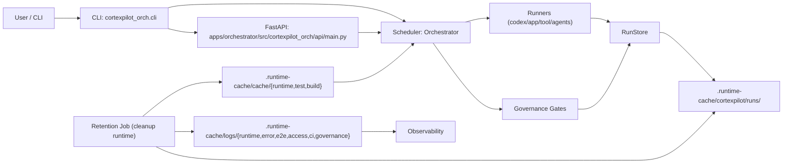

# Runtime Topology

## Notes
- API layer should stay protocol-focused and delegate orchestration to services.
- Current state: write-side run mutations in API (`evidence promote` / `reject` / `god-mode approve`) are routed through `OrchestrationService` first, with legacy fallback kept for test doubles and backward compatibility.
- Runtime artifacts (`manifest`, `events.jsonl`, reports) are generated per run.
- Run-bundle evidence logs (for example `tests/stdout.log`, `tests/stderr.log`, `codex/*/mcp_stderr.log`) are retained under `.runtime-cache/cortexpilot/runs/<run_id>/` as audit artifacts; they do not replace the primary operational log channels under `.runtime-cache/logs/`.
- Daily operator briefings are generated under `.runtime-cache/cortexpilot/briefings/` by `tooling/briefing_generator.py`; this is a governed reporting surface rather than an ad-hoc scratch directory.
- Chain orchestration now emits lifecycle evidence in `reports/chain_report.json` (`lifecycle` section) and event stream markers (`CHAIN_HANDOFF_STEP_MARKED`, `CHAIN_LIFECYCLE_EVALUATED`, `CHAIN_COMPLETED`) for PM→TL→Worker→Reviewer→Testing→TL→PM closure and reviewer quorum outcomes.
- Control-plane role transitions can be represented with `task_chain` `handoff` steps, keeping PM/TL transitions explicit and auditable without execution-side effects.
- Retention policy controls run/worktree/log/cache/codex-home/intake/contract-artifact lifecycle and writes reports to `.runtime-cache/cortexpilot/reports/retention_report.json`.
- Retention reports now also expose `log_lane_summary`, `test_output_visibility`, and `space_bridge`, so canonical log lanes plus the latest repo-side space audit are visible from one runtime-governance receipt.
- CI governance reports share the governed root `.runtime-cache/cortexpilot/reports/ci/`; policy tracks the root plus the authoritative `current_run/` receipt surface, while the stable leaf report lanes currently include `artifact_index/`, `break_glass/`, `cost_profile/`, `evidence_manifest/`, `portal/`, `routes/`, `runner_health/`, `sbom/`, and `slo/`.
- Release-evidence builders write provenance, release-anchor, canary, RUM, and DB-migration governance outputs under `.runtime-cache/cortexpilot/release/`.
- Space-governance reports write repo/external/shared-layer audit snapshots under `.runtime-cache/cortexpilot/reports/space_governance/`, embed the latest retention summary for log/evidence visibility, and expose `governance_owner` / `preserve_reason` / rebuild metadata per entry so operator-facing cleanup decisions stay explicit.
- Managed backup snapshots live under `.runtime-cache/cortexpilot/backups/`; they are runtime-owned historical safety nets, not primary truth surfaces and not part of default cleanup scope.
- Shared transient cache buckets also include `.runtime-cache/cache/tmp/` and `.runtime-cache/cache/gemini_ui_audit/` when test or Gemini audit flows need bounded scratch space beyond the canonical `runtime/test/build` lanes.
- Codex diagnostic-mode runs may legitimately materialize under `.runtime-cache/cortexpilot/runs_diagnostic/`; this is a governed parallel run-root for diagnostic-only execution, not a replacement for the primary `.runtime-cache/cortexpilot/runs/` surface.
- Browser profile runtime state is allowed only under `.runtime-cache/cortexpilot/browser-profiles/`; the older root `.runtime-cache/browser-profiles/` is a legacy compatibility surface and must not be treated as the preferred runtime root.
- Contract artifact cleanup scope follows configured `CORTEXPILOT_RUNTIME_CONTRACT_ROOT` inside `.runtime-cache/cortexpilot/contracts/`.
- Root cleanliness and runtime artifact routing are SSOT-driven by `configs/root_allowlist.json` + `configs/runtime_artifact_policy.json`; root-noise directories such as root `logs/`, root `.next/`, and root coverage artifacts are treated as governance violations rather than acceptable steady state.
- JS runtime machine state is app- or package-local and explicit: only `apps/dashboard/node_modules`, `apps/dashboard/.next`, `apps/dashboard/tsconfig.tsbuildinfo`, `apps/dashboard/tsconfig.typecheck.tsbuildinfo`, `apps/desktop/node_modules`, `apps/desktop/dist`, `apps/desktop/tsconfig.tsbuildinfo`, and `packages/frontend-api-client/node_modules` are allowed repo-local machine-managed surfaces; root `node_modules` remains forbidden.
- Log rotation remains owned by `observability/logger.py` (`RotatingFileHandler` + gzip rollover), while lifecycle cleanup remains owned by runtime retention and guarded high-yield cleanup remains owned by space governance. The three layers are complementary, not interchangeable.
- `~/.cache/cortexpilot` is the repo-external strong-related cache root, but it is still machine-shared across local CortexPilot worktrees and branches. Treat it as governed shared cache, not single-repo private disk.
- Log envelope SSOT is `schemas/log_event.v2.json`, and machine-consumed log correlation must stay auditable through `lane` + `correlation_kind`.
- Runtime de-monolith modules now carry orchestration helper load while preserving existing contracts: `api/main_*_helpers.py` + `api/main_runs_handlers.py` (API compatibility handlers), `chain/runtime_helpers.py` + `chain/runner_execution_helpers.py`, `replay/replay_helpers.py` + `replay/replayer_*_helpers.py`, `scheduler/preflight_gate_*` + `scheduler/task_execution_*` + `scheduler/execute_task_*`, `runners/agents_*_runtime.py` + `runners/agents_*_helpers.py`, and helper splits for planning/store/cli (`planning/intake_*_helpers.py`, `store/run_store_*_helpers.py`, `cli_*_helpers.py`).
- State-store compatibility helpers now aggregate workflow cards from the newest manifest timestamp instead of raw directory traversal order; this keeps `/api/workflows` status snapshots stable across Python/runtime/filesystem variants when multiple runs share one workflow id.
- Scheduler preflight bridge (`scheduler/execute_task_preflight.py`) now applies dependency and tool-loader overrides (`load_search_requests`, `load_browser_tasks`, `load_tampermonkey_tasks`) with restore-on-exit semantics, so test/runtime injections do not leak mutable global bindings across runs.
- Runtime-root test rebinding must invalidate cached config before switching roots; otherwise parallel/xdist orchestrator tests can read stale `.runtime-cache` locations and produce false-negative tool-pipeline evidence paths.
- Tool-pipeline search artifact writers now reuse the active `RunStore` instance for `search_results`, `verification`, and AI verification persistence so run-local artifact roots/locks stay consistent under parallel self-hosted CI.
- Tool-pipeline browser integration tests should stub `cortexpilot_orch.runners.tool_runner.BrowserRunner` instead of patching higher-level `ToolRunner.run_browser`; this keeps browser-task mocks stable even when scheduler/runtime layers hold imported `ToolRunner` references during large parallel suites.
